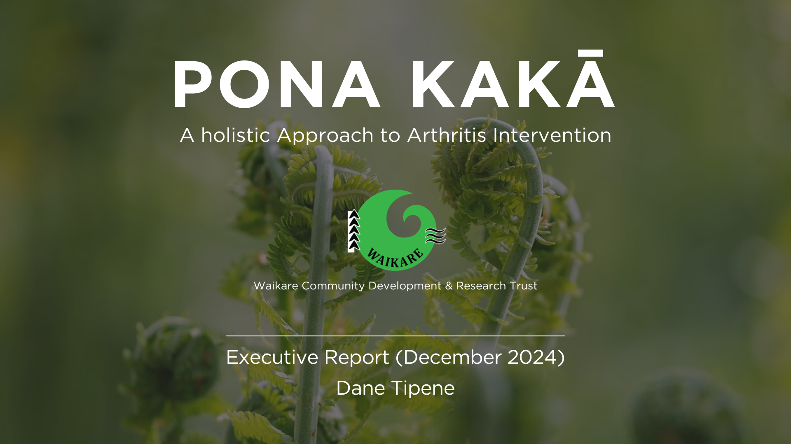
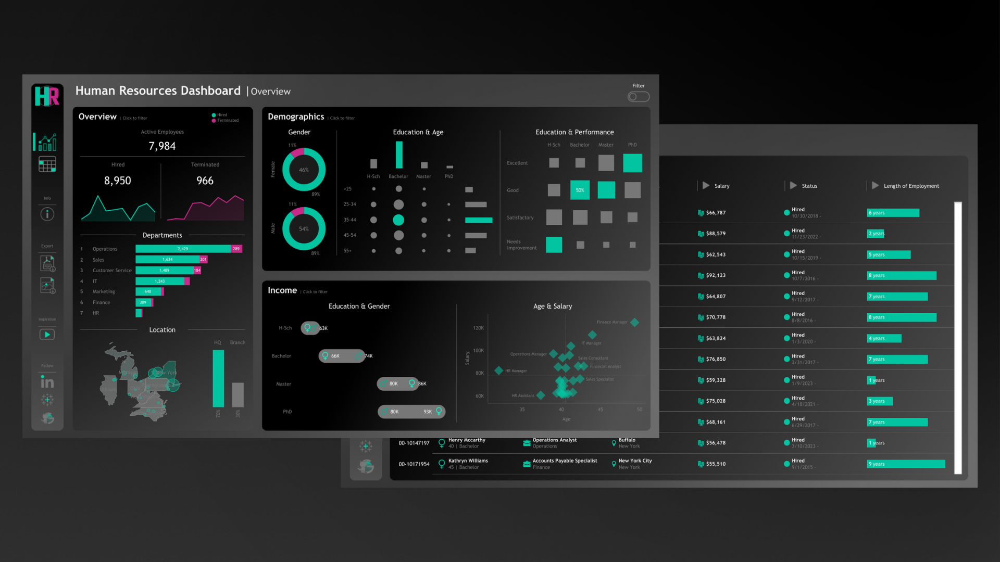
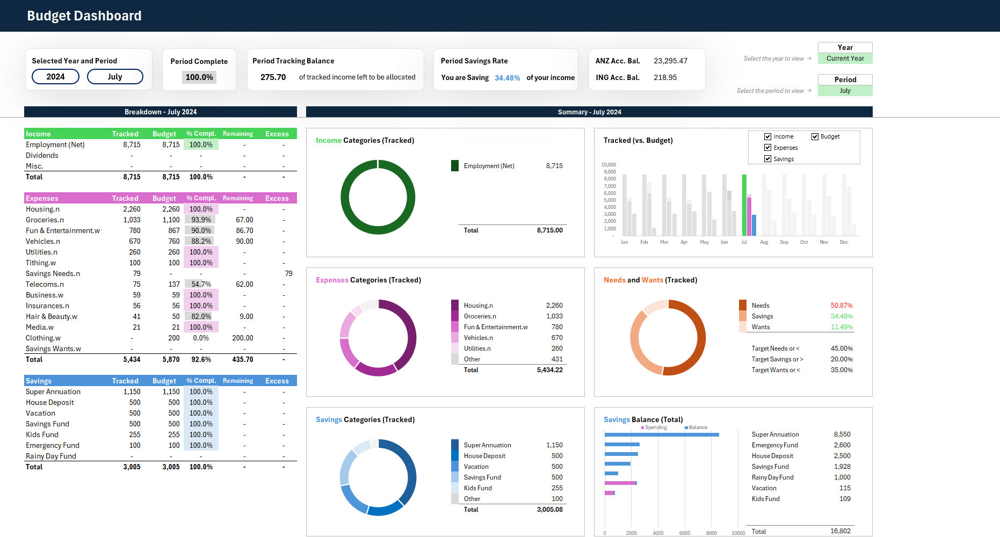

## Welcome!

This portfolio summary highlights my expertise in data analytics, demonstrating my ability to transform messy datasets into actionable insights, craft compelling visualizations, and solve business challenges through data-driven solutions. With a strong foundation in Python, R, SQL, Tableau, and Excel, these projects showcase advanced data manipulation, trend analysis, and predictive modelling. Each project highlights the importance of storytelling with data, effective stakeholder collaboration, and driving decision-making through clear, impactful dashboards and reports. This portfolio reflects my commitment to continuous learning, adaptability, and delivering results that align with business objectives.

[Resume](https://github.com/DataDaneHQ/Resume/blob/main/README.md)

 

## Victorian Electricity Hardship Analysis
*Assessing the Impact of Cost-of-Living Pressures on Residential Electricity Customers*

[Project Link Here](https://github.com/DataDaneHQ/Cost-of-Living_Pressures/blob/main/README.md)

### Project Overview
The rising cost of living has placed financial strain on residential electricity customers. This project analyzes arrears, disconnections, and financial assistance uptake to assess the impact of cost-of-living pressures on household energy affordability in Victoria.

Using Essential Services Commission (ESC) compliance and performance data, this study identifies key trends in financial distress, helping stakeholders understand where interventions may be needed.

### Potential Business Impact
✅ **Enhanced Consumer Protections:** Identified key financial hardship trends to support targeted policy interventions.  
✅ **Improved Assistance Programs:** Provided insights to refine financial aid programs for vulnerable households.  
✅ **Data-Driven Decision-Making:** Equipped policymakers and energy providers with actionable insights to anticipate and mitigate financial distress.  

### Tools & Technologies
* R & Posit Cloud
* ggplot2
* RMarkdown
* Canva

### Key Outcomes
* **Analyzed Energy Hardship Trends**: – Assessed arrears, disconnections, and financial assistance uptake over time.  
* **Identified Vulnerable Consumer**: Segments – Highlighted customer groups most impacted by rising costs.  
* **Developed Stakeholder Reports**: – Translated data findings into clear, actionable insights for decision-makers.  

### Skills Demonstrated
* Data Wrangling & Trend Analysis – Processed and analyzed financial hardship data.  
* Data Visualization & Insights – Created impactful visual summaries using ggplot2.  
* Policy-Oriented Reporting – Communicated findings in structured reports tailored to non-technical stakeholders.  
* Stakeholder Communication – Delivered clear, concise presentations highlighting key affordability challenges.  

 

## Salifort Motors Employee Attrition Analysis
*Predicting Employee Turnover with Machine Learning*

[Project Link Here](https://github.com/DataDaneHQ/Salifort_Motors_Attrition_Analysis/blob/main/README.md)

### Project Overview
Employee turnover at Salifort Motors increases hiring costs and disrupts workforce stability. This project developed a machine learning model to predict attrition, empowering HR with data-driven insights to enhance retention. Through exploratory data analysis (EDA) and predictive modeling, the study identified key risk factors and tested multiple models, with XGBoost emerging as the top performer (96.7% AUC-ROC)—a highly reliable tool for HR decision-making.

### Business Impact
✅ **Improved Workforce Retention**: Pinpointed key attrition drivers, enabling HR to implement targeted retention strategies.  
✅ **Reduced Hiring & Training Costs**: Anticipated high-risk attrition periods, minimizing workforce disruptions.  
✅ **Data-Driven HR Strategy**: Provided actionable recommendations on workload balance, career development, and pay transparency to address career stagnation, burnout, and compensation gaps.  

### Tools & Technologies
* Python & Jupyter Notebook
* MS Excel
* MS Word
* Fluxpro.ai
* Canva

### Key Outcomes
* **Uncovered Attrition Trends**: Conducted EDA to reveal key workforce risks.
* **Optimized Tenure-Based Segmentation**: Enhanced model interpretability and predictive accuracy.
* **Built & Evaluated ML Models**: Tested Decision Tree, Random Forest, and XGBoost, selecting XGBoost (96.7% AUC-ROC) as the best performer.
* **Implemented Robust Evaluation Metrics**: Utilized confusion matrices and high-recall prioritization for accurate predictions.
* **Translated Insights into HR Action Plans**: Delivered executive-level recommendations, guiding retention efforts.

### Skills Demonstrated
* Predictive Modeling & Machine Learning – Designed, optimized, and evaluated classification models for employee attrition.
* Feature Engineering – Enhanced categorical variable design for better model interpretability.
* Data Visualization & Insights – Applied seaborn, matplotlib, and sklearn.metrics for effective communication.
* HR Analytics & Strategy – Converted predictive insights into actionable retention initiatives.
* Stakeholder Communication – Delivered executive reports aligning data insights with HR and business goals.

 

## TikTok Claims Classification Project

[Project Link Here](https://github.com/DataDaneHQ/Coursera-TikTok-Capstone-Project/blob/main/README.md)

### Project Overview  
Content moderation is critical for ensuring platform integrity, but manual review of TikTok user reports is inefficient. This project developed a machine learning model to classify user reports as claims or opinions, enhancing content moderation accuracy and efficiency. Exploratory data analysis (EDA) and hypothesis testing guided feature selection, leading to a high-performing Random Forest model with 99.21% recall for identifying claims. The findings were delivered through an interactive Tableau dashboard and executive summaries tailored for stakeholders.

### Business Impact
✅ **Enhanced Moderation Efficiency**: Automated classification reduced manual workload for moderation teams.  
✅ **Improved User Experience**: Streamlined report handling ensured faster, more accurate content decisions.  
✅ **Strategic Insights for Platform Policy**: Data-driven analysis provided key recommendations for refining content policies and moderation workflows.

### Tools & Technologies
* Python & Jupyter Notebook
* Tableau
* Figma & Draw.io 
* MS Excel
* MS Word
* Canva 

### Key Outcomes
* Conducted In-Depth EDA: Identified trends and relationships in TikTok user interactions.
* Validated Assumptions with Hypothesis Testing: Ensured feature selection aligned with classification objectives.
* Developed and Optimized ML Models: Built Logistic Regression, Random Forest, and XGBoost, selecting Random Forest (99.21% recall) as the best model for identifying claims.
* Built an Interactive Tableau Dashboard: Summarized EDA insights for stakeholders with clear, actionable visualizations.
* Delivered Data-Driven Content Moderation Strategies: Provided executive reports translating findings into practical moderation improvements.

### Skills Demonstrated
* Machine Learning Model Development – Designed, tuned, and evaluated models for content classification.
* Data Analysis & Feature Engineering – Extracted key insights and optimized input features for better classification performance.
* Interactive Dashboard Creation – Translated complex data into clear, visual insights using Tableau.
* Stakeholder Communication – Presented findings in tailored technical and executive reports.
* Workflow & Process Optimization – Designed structured workflows to improve moderation pipelines.

 

## Accenture Project | Social Buzz

*Data-Driven Content Strategy for IPO Preparation*

[Project Link Here](https://github.com/DataDaneHQ/Accenture_Project_SocialBuzz/blob/main/README.md)

### Project Overview
This project is a comprehensive analysis of content engagement for Social Buzz, a fast-growing social media and content creation platform. As part of an advisory engagement with Accenture, the goal was to identify top-performing content categories, deliver actionable insights, and support Social Buzz’s IPO preparation through data-driven strategies.

### Business Impact
✅ **Optimized Content Strategy**: Identified top-performing content categories to maximize user engagement.  
✅ **Supported IPO Preparation**: Provided data-backed insights to refine platform positioning and growth strategy.  
✅ **Enhanced Retention & Monetization**: Offered actionable recommendations to increase user retention and long-term scalability.  

### Tools & Technologies
* Python & Jupyter Notebook
* MS Excel
* Tableau
* Figma & Draw.io
* Canva

### Key Outcomes
* Conducted Data Cleaning & Transformation: Ensured high-quality, reliable analysis for engagement insights.
* Uncovered Key User Preferences: Analysed content themes and formats driving the most engagement.
* Developed an Interactive Tableau Dashboard: Delivered data-driven visualizations for stakeholder decision-making.
* Presented Strategic Growth Recommendations: Summarized insights into scalable content strategies supporting IPO readiness.

### Skills Demonstrated
* Data Cleaning & Modeling – Ensured dataset integrity for accurate engagement analysis.
* Exploratory & Predictive Analysis – Identified content trends to optimize engagement and retention.
* Interactive Dashboard Development – Created dynamic, stakeholder-friendly data visualizations.
* Executive Reporting & Presentation – Delivered client-focused reports with actionable insights.
* Strategic Business Recommendations – Translated findings into growth-focused content strategies.

 

## Pona Kakā Data Analysis

*Culturally Informed Insights for Arthritis Intervention*

[Project Link Here](https://github.com/DataDaneHQ/Pona_Kaka/blob/main/README.md)

### Project Overview
This project, conducted for the Waikare Community Development and Research Trust and funded by the Health Research Council of New Zealand (HRCNZ), analysed qualitative and quantitative data from the Pona Kakā Initiative—a culturally grounded arthritis intervention for Māori communities.

Through thematic analysis, descriptive statistics, and visualization, the study uncovered key participant experiences, health outcomes, and program impact, providing actionable insights to enhance intervention effectiveness and guide future program decisions. Findings were synthesized into an executive report tailored for both technical and non-technical stakeholders.

### Business Impact
✅ **Enhanced Program Effectiveness**: Identified key participant experiences to refine intervention strategies.  
✅ **Informed Decision-Making**: Delivered data-driven insights to optimize community health initiatives.  
✅ **Strengthened Stakeholder Engagement**: Provided an accessible, visually engaging report to support funding and policy advocacy.  

### Tools & Technologies
* Python & Jupyter Notebook
* MS Excel
* MS Word
* Canva

### Key Outcomes
* Extracted Key Themes from Interview Data: Identified trends in pain management, treatment preferences, and quality of life.
* Developed an Initial Insights Report: Highlighted early themes to support strategic decision-making.
* Generated Statistical & Visual Analysis: Used Python to analyse participant health outcomes.
* Created an Executive-Level Report: Presented findings in an accessible format, emphasizing the initiative’s impact on Māori communities.

### Skills Demonstrated
* Qualitative & Quantitative Data Analysis – Integrated mixed-methods approaches for comprehensive program evaluation.
* Thematic Analysis & Data Categorization – Identified key patterns in participant experiences.
* Data Visualization & Statistical Insights – Translated complex health data into clear, actionable insights.
* Stakeholder Communication & Reporting – Delivered engaging, culturally aligned presentations.
* Community-Centered Research Approach – Ensured alignment with culturally significant objectives and holistic health practices.

 

## Bellabeat Smart Device Usage Analysis

*Data-Driven Insights to Optimize Health & Wellness Products*

[Project Link Here](https://github.com/DataDaneHQ/Coursera-Bellabeat-Capstone-Project/blob/main/README.md)

### Project Overview
This project analysed smart device usage data to uncover trends in physical activity, sleep, heart rate, and weight tracking. The goal was to provide data-driven insights that optimize Bellabeat’s product offerings and marketing strategies while supporting their mission to empower women with personalised health insights. By leveraging exploratory data analysis (EDA) and visualization techniques, the study identified user behavior trends and delivered strategic recommendations to enhance customer engagement and product effectiveness.

### Business Impact  
✅ **Optimized Product Development**: Identified key user behaviors to refine features and improve product-market fit.  
✅ **Enhanced Customer Engagement**: Delivered data-driven recommendations to personalise health insights.  
✅ **Strengthened Marketing Strategy**: Provided insights to align content and campaigns with user needs.

### Tools & Technologies
* R Studio
* MS Excel
* ggplot

### Key Outcomes
* Analysed User Behavior Trends: Identified patterns in activity, sleep, heart rate, and weight tracking.
* Developed Strategic Recommendations: Provided actionable insights to enhance customer engagement.
* Aligned Insights with Business Goals: Strengthened Bellabeat’s mission to empower women through personalised health data.

### Skills Demonstrated
* Exploratory Data Analysis & Trend Identification – Extracted insights from large datasets to inform decision-making.
* Advanced Data Visualization & Storytelling – Used ggplot to translate data into compelling insights.
* Data-Driven Strategic Recommendations – Delivered insights to improve customer engagement and product design.
* Statistical Analysis of Health & Wellness Metrics – Evaluated trends in biometric and behavioral data.
* Business Alignment & Decision Support – Ensured findings aligned with Bellabeat’s market strategy and user needs.

 

## Tableau HR Dashboard

*Interactive Workforce Analytics & Visualization*

[Project Link Here](https://github.com/DataDaneHQ/HR_Dashboard_Project/blob/main/README.md)

### Project Overview
This project showcases the design and development of a dynamic HR analytics dashboard, integrating realistic dataset generation and advanced data visualization. Using Python’s Faker Library, a structured HR dataset was created to simulate workforce analytics, ensuring accuracy and relevance.

Built in Tableau, the dashboard provides interactive insights into employee demographics, performance trends, and attrition patterns, empowering HR teams to make data-driven decisions. Inspired by Baraa Khatib Salkini’s expert tutorial, the project honed dashboard UX design, layout optimization, and data storytelling skills.

### Business Impact
✅ **Data-Driven HR Decision-Making**: Provided stakeholders with real-time workforce insights to improve HR strategies.  
✅ **Workforce Optimization**: Identified key trends in performance, diversity, and attrition to enhance HR planning.  
✅ **Clear & Engaging Data Communication**: Designed an intuitive, interactive dashboard for actionable insights.

### Tools & Technologies
* Python (Faker Library)
* Jupyter Lab
* Tableau
* Draw.io & Figma
* Flaticon

### Key Outcomes
* Created a Structured HR Dataset: Used Python’s Faker Library for realistic workforce modeling.
* Developed an Interactive Tableau Dashboard: Visualized key HR metrics with advanced analytics.
* Optimized Dashboard UX/UI: Ensured intuitive navigation and layout for an enhanced user experience.
* Enhanced Dashboard Aesthetics: Incorporated custom design elements using Figma and Flaticon.
* Documented the Full Design Process: Provided a step-by-step breakdown of dashboard creation and data visualization.

### Skills Demonstrated
* HR Data Generation & Preparation – Developed realistic datasets for workforce analytics.
* Advanced Data Visualization (Tableau) – Designed interactive dashboards for HR insights.
* UX/UI Optimization for Dashboards – Created a user-friendly and professional interface.
* Graphic Design & Customization – Improved dashboard aesthetics with tailored visuals.
* Project Documentation & Data Storytelling – Mapped and refined the end-to-end development process.

 

## Personal Finance Dashboard

*Interactive Budgeting & Financial Planning Tool*

[Project Link Here](https://github.com/DataDaneHQ/Personal_Finance_Planner/blob/main/README.md)

### Project Overview
This Excel-based personal finance dashboard is designed to help users plan, track, and visualize their budget effectively. Inspired by The Office Lab’s budgeting template, this enhanced version integrates advanced Excel functionalities, including multi-period budget planning, savings tracking, and expense categorization. The interactive dashboard consolidates financial data into a user-friendly interface, making financial management more structured, intuitive, and actionable.

### Business Impact
✅ **Financial Clarity & Control**: Empowers users with structured budget tracking for income, expenses, and savings.  
✅ **Data-Driven Decision-Making**: Visualizes planned vs. actual expenses to facilitate real-time financial adjustments.  
✅ **Optimized Budgeting Efficiency**: Implements zero-based budgeting, ensuring every dollar is allocated effectively.

### Tools & Technologies
* MS Excel

### Key Outcomes
* Developed a Zero-Based Budgeting System: Enabled users to manage inconsistent income streams effectively.
* Integrated Real-Life Financial Features: Added bank account tracking, a "Needs vs. Wants" expense categorization tool, and a savings tracker with stacked bar charts.
* Designed an Interactive Financial Dashboard: Improved data visualization and usability for intuitive financial planning.
* Applied Advanced Excel Features: Implemented dropdown lists, conditional formatting, and dynamic charting for an enhanced user experience.

### Skills Demonstrated
* Advanced Excel & Data Visualization – Formula-driven budgeting, financial tracking, and dynamic charting.
* UX/UI Dashboard Design – Created an intuitive, user-friendly interface for financial planning.
* Budget Planning & Financial Analytics – Developed structured budget tracking workflows with real-time insights.
* Integration of Real-World Financial Features – Incorporated bank account monitoring and savings tracking for practical application.
* Customization & Process Optimization – Adapted templates to personalised financial planning needs.

 

## Data Cleaning Tutorial

*A Hands-On Guide to Preparing the Titanic Dataset for Analysis*

[Project Link Here](https://github.com/DataDaneHQ/Data_Cleaning_Tutorial/blob/main/README.md)

### Project Overview
This structured, hands-on tutorial walks users through cleaning and preparing the Titanic dataset for data analysis and machine learning. Covering essential data cleaning techniques, it demonstrates how to handle duplicates, missing values, outliers, and data type inconsistencies. Designed for both beginners and intermediate users, this tutorial enhances practical Python skills and improves data preparation efficiency for real-world applications.

### Business Impact
✅ **Enhanced Data Quality**: Ensures datasets are clean, consistent, and ready for analysis.  
✅ **Optimized Machine Learning Performance**: Prepares data for accurate and reliable model training.  
✅ **Scalable Data Cleaning Techniques**: Provides reusable methods applicable across various real-world datasets.

### Tools & Technologies
* Python & Jupyter Notebook

### Key Outcomes
* Demonstrated Practical Data Cleaning Techniques: Addressed duplicates, missing data, outliers, and data type inconsistencies.
* Provided Hands-On Python Examples: Enabled users to apply techniques in real time.
* Designed an Engaging, Beginner-Friendly Tutorial: Also catered to intermediate learners refining their data skills.
* Established a Strong Foundation for Data Analysis & Machine Learning: Ensured datasets are clean, structured, and model-ready.

### Skills Demonstrated
* Data Cleaning & Preprocessing – Applied structured methodologies to prepare raw datasets for analysis.
* Python for Data Wrangling – Solved common data quality issues using industry-standard libraries.
* Technical Writing & Tutorial Development – Created a clear, step-by-step learning guide.
* Machine Learning Data Preparation – Ensured efficient, ML-ready data structures.
* Effective Communication of Technical Concepts – Delivered an accessible, engaging learning experience for diverse audiences.

 

## Projects to Come

* **Quantium:** Analysing transaction and customer data to identify trends and inconsistences.
  * Python, feature engineering, visualization, and presentation
* **Customer Experience Analytics Project:** Development of machine learning models to classify sentiment and categorize customer feedback, uncovering additional metrics for enhanced Customer Experience insights.
  * MS Excel, Python, feature engineering, machine learning, automated text classification, and sentiment analysis.
