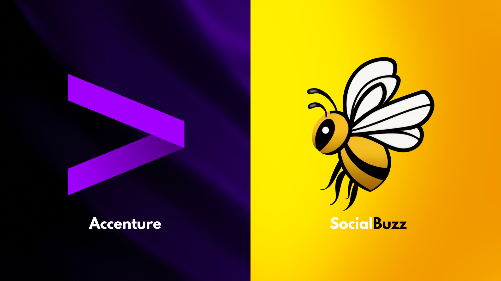

## Welcome!

This portfolio summary highlights my expertise in data analytics, demonstrating my ability to transform messy datasets into actionable insights, craft compelling visualizations, and solve business challenges through data-driven solutions. With a strong foundation in Python, R, SQL, Tableau, and Excel, these projects showcase advanced data manipulation, trend analysis, and predictive modelling. Each project highlights the importance of storytelling with data, effective stakeholder collaboration, and driving decision-making through clear, impactful dashboards and reports. This portfolio reflects my commitment to continuous learning, adaptability, and delivering results that align with business objectives.

[Resume](https://github.com/DataDaneHQ/Resume/blob/main/README.md)

 

## Accenture Project | Social Buzz

[Project Link Here](https://github.com/DataDaneHQ/Accenture_Project_SocialBuzz/blob/main/README.md)

### Objective
To analyze content engagement for Social Buzz, a social media platform, identifying top-performing content categories and providing actionable insights to support their IPO preparation and growth strategies.

### Tools Used
* MS Excel
* Python and Jupyter Notebook
* Tableau
* Figma
* Draw.io
* Canva

### Key Outcomes
* Conducted data cleaning, transformation, and modelling to ensure high-quality, reliable analysis.
* Uncovered key user preferences across content themes and formats, highlighting top-performing categories to optimize engagement and retention.
* Developed an interactive Tableau dashboard showcasing engagement trends by category and content type for stakeholder review.
* Delivered a client-focused presentation via Canva, summarizing insights and recommending strategies for scalable growth.

### Skills Demonstrated
* Data cleaning, transformation, and hypothesis testing
* Exploratory and predictive data analysis
* Interactive dashboard design and visualization
* Client-oriented reporting and presentation skills
* Strategic recommendation development for business growth

 

## Pona Kakā Data Analysis

[Project Link Here](https://github.com/DataDaneHQ/Pona_Kaka/blob/main/README.md)

### Objective
To analyze qualitative and quantitative data for the Pona Kakā Initiative, uncovering insights into participants' experiences and health outcomes to support program improvement and expansion.

### Tools Used
* MS Word
* MS Excel
* Python and Jupyter Notebook
* Canva

### Key Outcomes
* Identified key themes from interview data, such as pain duration and treatment preferences, providing actionable insights for program refinement.  
* Delivered an Initial Summary of Insights Report, highlighting early themes to guide decision-making.  
* Generated descriptive statistics and visualizations using Python, revealing trends in participant health outcomes.  
* Synthesized findings into a visually engaging executive report, accessible to non-technical stakeholders, showcasing the initiative’s impact on Māori communities.

### Skills Demonstrated
* Qualitative and quantitative data analysis
* Thematic analysis and data categorization
* Descriptive statistics and data visualization
* Clear communication of complex insights through reporting and presentation design
* Collaboration and alignment with culturally significant objectives

 

## Bellabeat Smart Device Usage Analysis

[Project Link Here](https://github.com/DataDaneHQ/Coursera-Bellabeat-Capstone-Project/blob/main/README.md)

### Objective
To analyze smart device usage data and uncover actionable insights to optimize Bellabeat's health and wellness products, enhance marketing strategies, and empower women with data-driven health insights.

### Tools Used
* R Studio
* MS Excel
* ggplot for visualizations

### Key Outcomes
* Identified user behavior trends in physical activity, sleep, heart rate, and weight tracking, providing a comprehensive understanding of customer needs.
* Delivered actionable recommendations to enhance product features and marketing strategies, driving customer engagement and product effectiveness.
* Supported Bellabeat's mission by aligning insights with their goal to empower women through personalized health data.

### Skills Demonstrated
* Exploratory data analysis and trend identification
* Advanced data visualization and storytelling
* Data-driven strategic recommendation development
* Statistical analysis of health and wellness metrics
* Alignment of insights with business objectives

 

## TikTok Claims Classification Project

[Project Link Here](https://github.com/DataDaneHQ/Coursera-TikTok-Capstone-Project/blob/main/README.md)

### Objective
To develop a machine learning model for classifying TikTok user reports as claims or opinions, enhancing content moderation efficiency and improving user experience through data-driven insights and cross-functional collaboration.

### Tools Used
* Python and Jupyter Notebook
* Tableau
* Figma
* Draw.io
* MS Excel
* MS Word
* Canva

### Key Outcomes
* Conducted thorough exploratory data analysis (EDA) to uncover trends and relationships in TikTok user interactions.
* Performed hypothesis testing to validate assumptions and guide feature selection for the classification model.
* Built a logistic regression model to analyze video characteristics and user verification status, informing feature selection for content classification.
* Developed an interactive Tableau dashboard summarizing EDA insights for stakeholders.
* Built and evaluated machine learning models (Random Forest and XGBoost), selecting Random Forest with 99.21% recall for identifying claims.
* Delivered detailed technical and high-level executive summaries tailored to internal and external stakeholders, aligning findings with strategic goals.

### Skills Demonstrated
* Workflow design and milestone tracking
* Exploratory and hypothesis-driven data analysis
* Interactive dashboard creation for data visualization
* Stakeholder communication with tailored technical and executive reports
* Logistic regression model development
* Machine learning model development

 

## Tableau HR Dashboard

[Project Link Here](https://github.com/DataDaneHQ/HR_Dashboard_Project/blob/main/README.md)

### Objective
To design and develop a dynamic and interactive HR data dashboard, combining realistic dataset generation with advanced visualization techniques to deliver clear and actionable insights.

### Tools Used
* Python (Faker Library)
* Jupyter Lab
* Tableau
* Draw.io
* Figma
* Flaticon

### Key Outcomes
* Realistic Dataset Creation: Generated a structured, HR-focused dataset using Python’s Faker Library, ensuring accuracy and relevance for analysis.
* Advanced Data Visualization: Mastered Tableau techniques to build insightful, interactive charts and graphs tailored for HR data analysis.
* Efficient Dashboard Design: Applied layout design principles with Draw.io and customized icons (Flaticon) to enhance user navigation and visual appeal.
* Professional Visual Design: Developed a custom Figma background, elevating the dashboard's professional aesthetics.
* Interactive Insights: Delivered an interactive Tableau dashboard enabling in-depth analysis and actionable HR insights.

### Skills Demonstrated
* Data generation and preparation
* Advanced data visualization in Tableau
* Dashboard UX/UI design and layout optimization
* Graphic design and icon customization for visual appeal
* Documentation and process-based project planning

 

## Personal Finance Dashboard

[Project Link Here](https://github.com/DataDaneHQ/Personal_Finance_Planner/blob/main/README.md)

### Objective
To create an Excel-based personal finance dashboard that enables users to plan, track, and visualize their budget, providing greater control over income, expenses, and savings through interactive, user-friendly tools.

### Tools Used
* MS Excel

### Key Outcomes
* Developed a comprehensive zero-based budgeting tool, allowing users to manage inconsistent income streams and plan for multi-period budgets effectively.
* Enhanced the dashboard with new features, including bank account integration, a "Needs vs. Wants" expense tracker, and a savings tracker with a stacked bar chart.
* Designed an interactive dashboard consolidating all budget data into dynamic visual displays, improving usability and decision-making.
* Applied advanced Excel skills, including dropdown lists, conditional formatting, and dynamic charting, to enhance the functionality and user experience.

### Skills Demonstrated
* Advanced Excel skills: data organization, formula creation, and dynamic charting
* UX/UI design for dashboard creation
* Budget planning and financial data visualization
* Integration of additional features for real-life application, such as bank account tracking and savings monitoring
* Adaptation of existing templates with personal customizations to meet specific needs

 

## Data Cleaning Tutorial

[Project Link Here](https://github.com/DataDaneHQ/Data_Cleaning_Tutorial/blob/main/README.md)

### Objective
To provide a step-by-step guide for cleaning and preparing the Titanic dataset for analysis and machine learning, equipping users with essential Python techniques for effective data preparation.

### Tools Used
* Python
* Jupyter Notebook

### Key Outcomes
* Demonstrated practical techniques for handling duplicates, managing missing data, detecting and addressing outliers, and correcting data types.
* Enhanced participants' Python skills through clear, hands-on examples and code snippets.
* Provided a foundation for insightful data analysis
* Designed an engaging, beginner-friendly tutorial that also caters to intermediate users seeking to refine their data cleaning techniques.

### Skills Demonstrated
* Data cleaning and preprocessing
* Problem-solving with Python for real-world datasets
* Tutorial creation with a focus on clarity and practical application
* Structured approach to preparing data for analysis and machine learning
* Communication of technical concepts to a broad audience

 

## Projects to Come

* **Quantium:** Analysing transaction and customer data to identify trends and inconsistences.
  * Python, feature engineering, visualization, and presentation
* **Saguity:** Development of machine learning models to classify sentiment and categorize customer feedback, uncovering additional metrics for enhanced Customer Experience insights.
  * MS Excel, Python, feature engineering, machine learning, automated text classification, and sentiment analysis.
